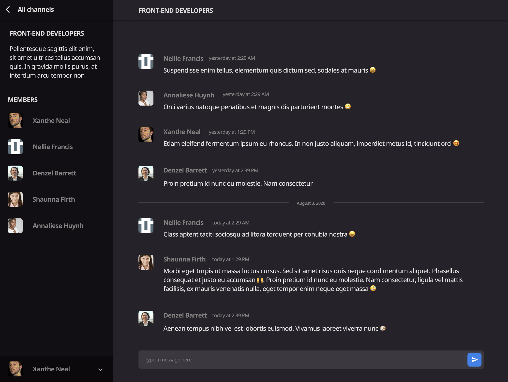

### Brief: Discord Replacement

Make a real-time chat application for the web browser, similar to Discord.

(Screenshots taken from [devchallenges.io](https://devchallenges.io/challenges/UgCqszKR7Q7oqb4kRfI0))

### High Level Product Requirements

- Browser based.
- Registration, login, and user profile flows.
- Users can create and navigate channels.
- Users can chat in realtime.
