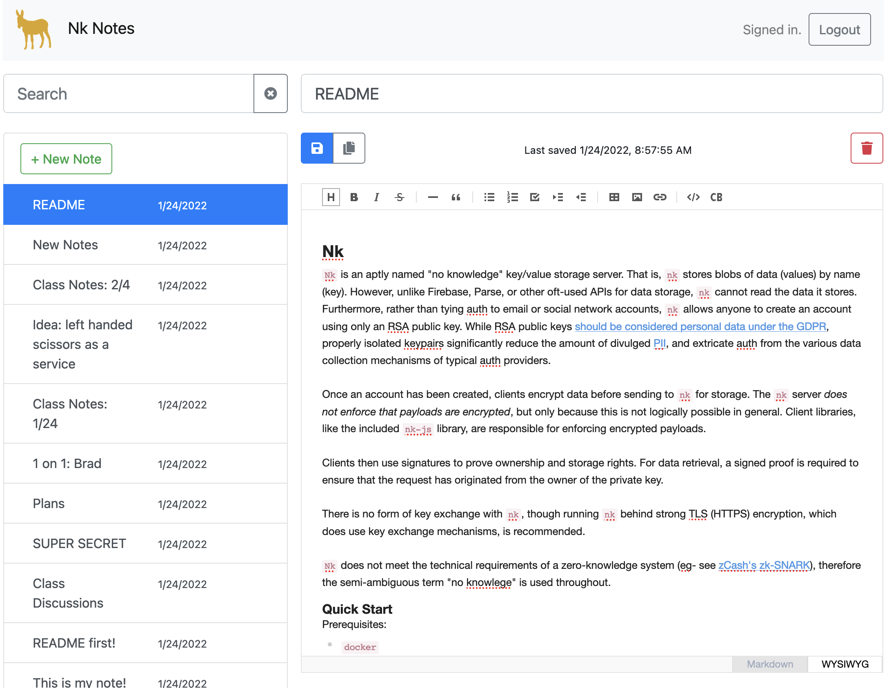

### Brief: Evernote Replacement

Make a note-taking application for the web browser, similar to Evernote.

(Screenshots taken from [Nevernote](https://thegoldenmule.github.io/nk/).)

### High Level Product Requirements

- Browser based.
- Registration, login, and user profile flows.
- Users can create and share notes.
- Users can publish notes to the web.
