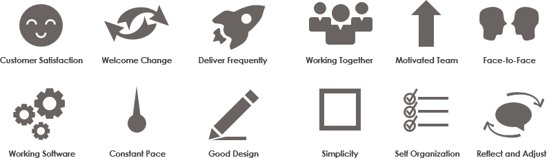
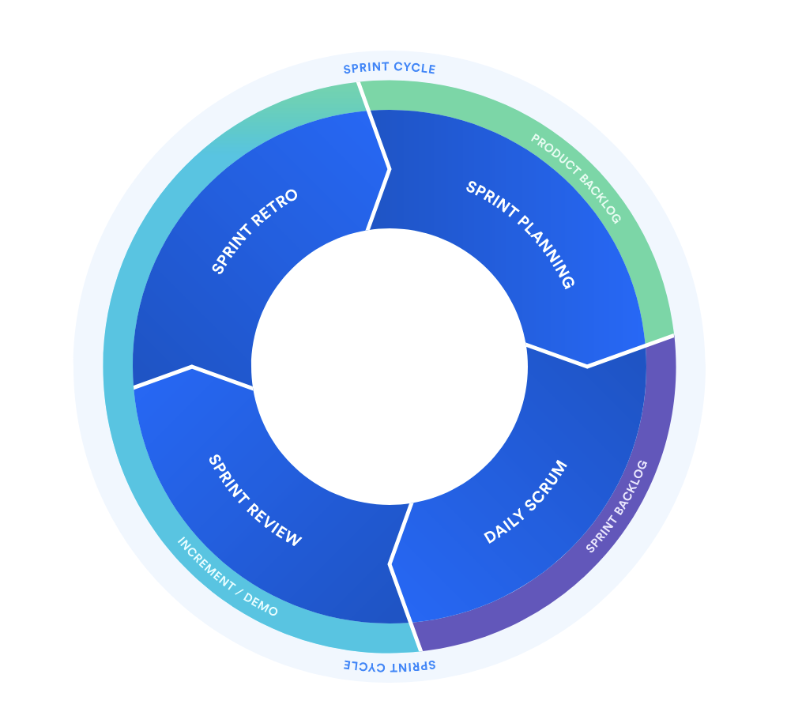

* **Class Discussion**
    * [Manifesto](https://agilemanifesto.org/)
        * Initial thoughts? Surprising? No process here.
        * "We are uncovering better ways of developing software _by doing it_ and helping others do it."
        * Individuals and interactions over processes and tools.
            * Understanding over checkboxes. Conversations. Process is a means to an end.
            * How are interations related to processes?
            * Do you agree with this? Why or why not?
        * Working software over comprehensive documentation.
            * Remember the Waterfall graphs!
            * "We value documentation, but functionality more."
            * What is "comprehensive" documentation? To what degree do we document then?
        * Customer collaboration over contract negotiation.
            * Relationship is at the center.
            * Assumes there IS a customer. Assumes you know the IDENTITY of your customer. Who is your customer?
            * What is the difference between collaboration and negotiation?
            * What are some examples of win-win v win-lose?
        * Response over planning.
            * "We value planning, but responding more."
    * [Principles](https://agilemanifesto.org/principles.html)
        * 
        * No process here either.
        * **Group discussion**.
        * You're not going to remember all twelve. What are your group's favorites?
    * Scrum Sprints
        * "Agile in action" -- finally, a process.
        
        * See manifesto: **Agile throws Scrum under the bus when it needs to**.
        * Planning
            * Epic
            * User story
            * Task / sub-task
        * Daily Scrums
            * "Standups"
            * 10 seconds
            * Three questions.
                * What did you do last?
                * What are you doing now?
                * What are you blocked on?
        * Review
            * Delivery.
            * Collaborative review.
        * Retro
            * Lots of ways to frame this.
            * What should we keep doing?
            * What should we stop doing?
            * What new things should we do?
        * Backlog
        * Bug Triage
* **Group Discussion**
    * Which 2 or 3 principles does your group value the most?
    * Make a new principle that sums it up for your group.
* **Assignments**
    * **This is a graded assignment, due Monday, 31st by 6:15pm**.
        * Create a GitHub account if you do not have one.
        * Create your group's git repo.
            * Use GitHub, not GitLab.
        * Edit your README.md.
            * Add your group name.
            * Link to brief you're going to be following.
            * In one or two sentences, add a description of your customer.
            * Add your group's central principle.
        * Send me a link to your GitHub repo.
* **Reading**
    * ["Basics of the Unix Philosophy"](https://homepage.cs.uri.edu/~thenry/resources/unix_art/ch01s06.html)
        * Read the first section. Pick your favorite **three rules**, read their subsections, and be ready to discuss.
    * ["Rise of Worse is Better"](https://www.dreamsongs.com/RiseOfWorseIsBetter.html)