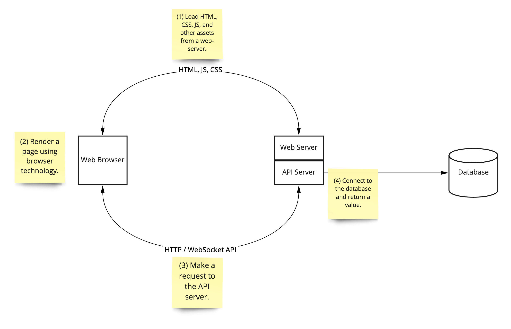

* **Discussion**
    * User Stories!!
* **Sprint 1 Planning**
    * **Dates: 2-9 through 2-21.**
    * **Goal:  Build the scaffolding.** By the end of the sprint, your team should be able to demonstrate the four main technologies of your project: client, web server, api function, and database.
    
    * **Deliverables**
        * Due at the start of class on 2-21 (reminder that this is **15%** of your semester grade).
        * A live demo.
        * An **annotated tag** in GitHub.
    * **Backlog**
        * [Backlog for Evernote brief](../briefs/evernote-backlog.md)
        * [Backlog for Discord brief](../briefs/discord-backlog.md)
* **Tasking**
    * Add user stories to backlog column in Trello.
    * Drag user stories in to committed column.
    * Break down work into tasks.
    * Tasks should each contain:
        * Short description of the work to be done.
        * Who is doing the work.
        * How long the work is expected to take (1h, 15m, .5h, etc).
        * Tasks should be no longer than **two hours**.
    * Ensure that each person has enough work, and no one is over-burdened.
* **Assignments**
    * **Completed sprint plans are due by start of class on Monday, Feb 14**.
* **Reading**
    * [The standard of code review](https://google.github.io/eng-practices/review/reviewer/standard.html)
    * [What to look for in a code review](https://google.github.io/eng-practices/review/reviewer/looking-for.html)
