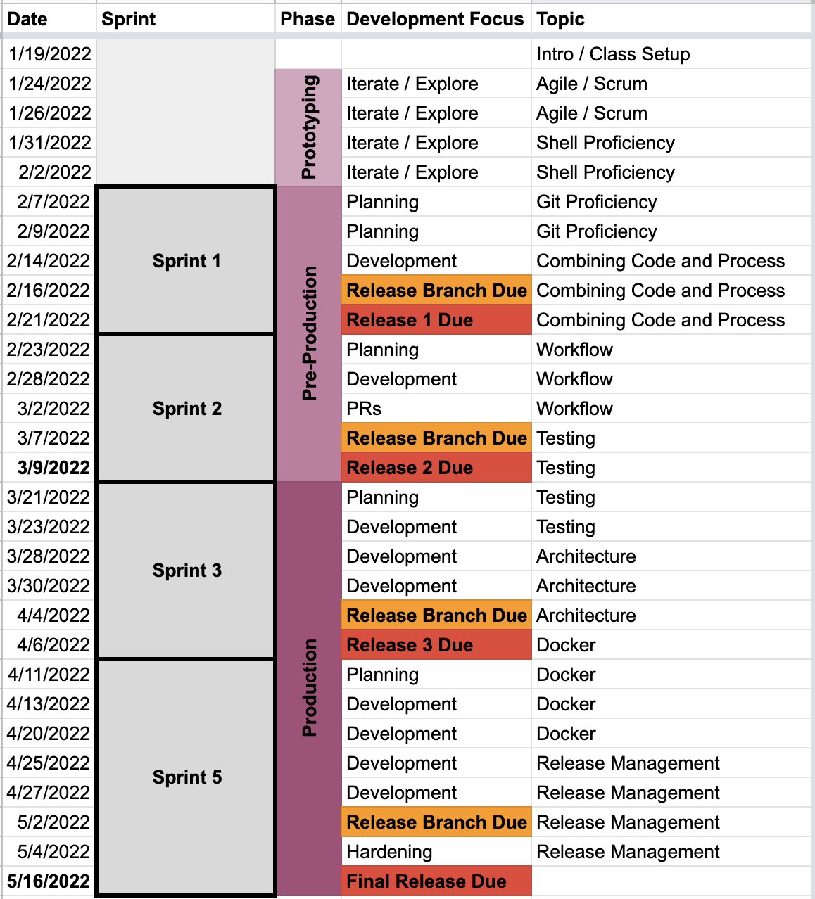

## CSCI 5030

**Time** We will meet Monday and Wednesday from 6:15-7:30 PM in RTH 346. [Full calendar below](#calendar).

**Instructor** Benjamin Jordan

**Email** benjamin.jordan@slu.edu

**Discord** https://discord.gg/2DBgnzH3

**Office Hours** I do not hold regular office hours but will respond in a timely manner over Discord or email from 9AM - 5PM M-F. Nights and weekends my reponse time will vary but I will try my best to respond quickly.

## Course Description

> An overview of software development at a graduate level, including software engineering processes, software design and architecture, testing and quality assurance, and selected other topics of interest to software practitioners.

## Student Learning Outcomes

After successfully completing this course, students will be able to:

- Conduct a software development project as part of a team.
- Use an agile process such as Scrum.
- Make effective use of a modern version control system.
- Use principles of software design in the implementation of a medium-to-large scale software project.
- Design and implement thorough test suites.
- Conduct effective code reviews and refactor existing code.

## Required Resources

There is no textbook for this course, but students must have access to a computer running macOS, Linux, or Windows for development as well as a web browser for readings.

Students also have the option of doing their work on departmental computer systems, including our server: `hopper.slu.edu`. Contact me if you need help accessing these resources.

## Attendence

Students are expected to attend all class meetings, participate in discussions, and take part in sprint meetings with their group. In case of illness or other serious situations, students should contact the instructor to explain the reason for their absence. Unexcused absences will count against the student’s grade on the semester project.

### Covid Policy

For this semester, we will be meeting, primarily, **in-person**. This is subject to change given the evolving nature of the pandemic, and further detail on  SLU policy may be found [here](https://www.slu.edu/provost/faculty-affairs/teaching-resources-for-faculty/course-syllabus-information/syllabus-statements/syllabus-stmt_in-class-attendance-and-participation.docx). Suffice it to say, if you are feeling ill or are required to quarantine, let me know and we will accommodate via a combination of Zoom, recorded lectures, or supplemental resources. If _I_ am ill or required to quarantine, we will meet via Zoom.

As a reminder, **all students are required to wear face masks** at all times when in the building, as given by the [SLU Face Mask Policy](https://www.slu.edu/provost/faculty-affairs/teaching-resources-for-faculty/course-syllabus-information/syllabus-statements/syllabus-stmt_face-masks.docx).

## Structure

This class will be broken up into lectures and breakout group work. We will be covering major topics using assigned readings and lectures, then applying those learnings in group-based product development. Each group will work together on a long-term project, which will culminate in a deployed application at the end of the semester.

## Grading

Grading will be done primarily on work committed to GitHub and deployed software releases. This will include code (and comments!), commit messages, and documentation.

> If work is not committed _and pushed_ to GitHub, it is incomplete.

> If work does not provide sufficient comments or documentation, it is incomplete.

> If code does not run, it is incomplete.

**_Any resource_ may be used to complete assignments** unless otherwise specified. Google things. Talk to other people. Discuss approaches in the Discord. Use open source code. However, all work must be properly attributed (see [**Academic Integrity**](#Academic_Integrity) section).

It is up to my discretion to determine if a group is using too much code "found elsewhere". In such a case, the third party code must be removed.

### Assigned Readings

When readings are assigned, they should be completed by the next class as they are part of the group discussion. Additionally, lectures may not make sense without having read the assigned material.

### Assignments

The largest single component of this course will be the hands-on assigments, which will generally be focused toward the semester project. These assignments will be code, process, or documentation related.

- All due dates will be specified with the work.
- Assignments that come in past the due date will lose 10% immediately and 10% every week thereafter.
- Incomplete assignments will lose an automatic 15%. It is better for work to be late than incomplete.

### Exams

Exams will be in the form of _releases_, i.e. deliveries of a software product. There are four releases, given in the [Calendar](#Calendar) section below.

### Scale / Weighting

Grading will be on an uncurved scale:

92-100% (A)
90-91% (A-)
82-89% (B)
80-81% (B-)
72-79% (C)
70-71% (C-)
62-69% (D)
60-61% (D-)
59% and below (F)

Grades will be weighted as follows:

||Weight|
|-|-|
|Assignments|30%|
|Release 1|15%|
|Release 2|15%|
|Release 3|15%|
|Final Release|25%|

## Calendar

Class will meet at the following times and cover these rough topics.

## Academic Integrity 

University policy may be found [here](https://www.slu.edu/provost/faculty-affairs/teaching-resources-for-faculty/course-syllabus-information/syllabus-statements/syllabus-stmt_academic-integrity.docx). In addition, students are expected to follow the [Honesty Policy of the College of Arts & Sciences](http://www.slu.edu/college-of-arts-and-sciences-home/undergraduate-education/academic-honesty).

For the purposes of this clas, we will be leaning heavily on Open Source Software, which must follow industry-standard licensing protocol:

- If you are using code you didn't write, that code must be licensed by the author. If there is no license, you cannot use it. In addition, verify that the provided license associated with the code allows the given educational usage. See [TLDR Legal](https://tldrlegal.com/) if you are unsure. Generally, licenses must be included in the codebase and attribution must be included with the code. Some licenses are more restrictive and may not allow you to use code at all.

- For short bits (<= 10 lines) copy/pasted from knowledge bases (like StackOverflow) or blogs, include a link to the resource as a code comment. For longer excerpts, please get explicit permission from me.

## Disability Accommodations

The University policy can be found [here](https://www.slu.edu/provost/faculty-affairs/teaching-resources-for-faculty/course-syllabus-information/syllabus-statements/syllabus-stmt_disability-accommodations.docx).

## Title IX

The University policy can be found [here](https://www.slu.edu/provost/faculty-affairs/teaching-resources-for-faculty/course-syllabus-information/syllabus-statements/syllabus-stmt-title-ix.docx).